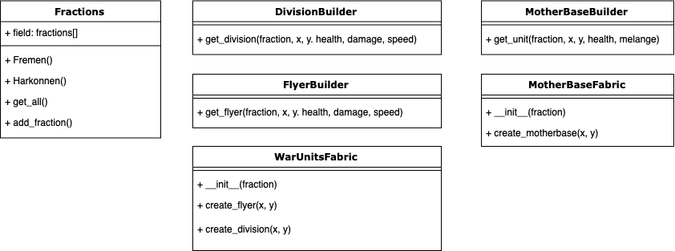
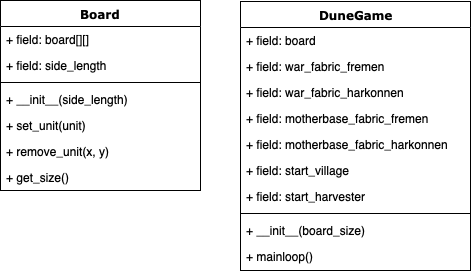

# Dune
Пошаговая стратегия. Фиксированы две фракции: Fremen и House Harkonnen.
Игровое поле (Board) представляет собой квадратную матрицу прямоугольных ячеек.
Ячейка может быть либо пустой (`None`), либо содержать объект, базовый класс которого - `Unit`.

В начале игры у каждой рассы имеется по одному Unit'у класса `MotherBase`; располагаются в противоположных
углах игрового поля.

Unit не обязан иметь шкалу здоровья, перемещаться и вообще изменяться во время игры.
Обязательные аттрибуты Unit'а: фракция (`fraction`) и координаты (`x`, `y`) на игровом поле.

### Иерархия Unit'ов
Unit'ы класса `Harvester` доступны только фракции `HouseHarkonnen`, класса `Village` - `Fremen`. Классы `Division` и `Flyer` доступны обеим фракциям (основные войска).

### Классы, обслуживающие Unit'ы
`Fractions` - класс, предоставляющий доступ к строковым идентификаторам фракций, которые можно использовать как метки классов.

### Остальные классы
+ `$ DuneGame` - общий Singleton игры
+ `$ Board` - класс игрового поля, хранит и предоставляет доступ к матрице Unit'ов

### Запуск
`python3 sources/main.py`

### Тестирование
+ `$ pytest sources/` в корневой директории репозитория
+ `$ pytest` в директории `sources`