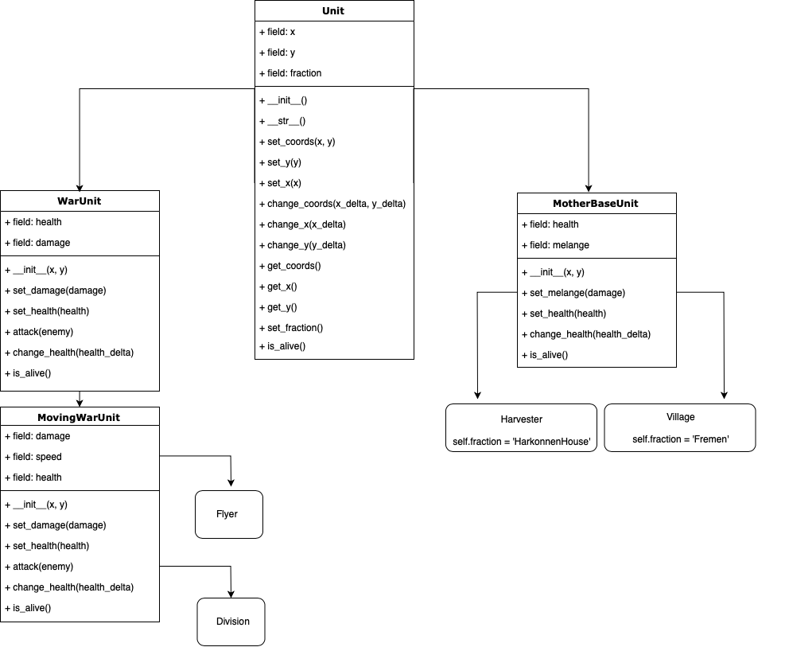

# Dune
Пошаговая стратегия. Фиксированы две фракции: Fremen и House Harkonnen.
Игровое поле (Board) представляет собой квадратную матрицу прямоугольных ячеек.
Ячейка может быть либо пустой (None), либо содержать объект, базовый класс которого - Unit.

Unit не обязан иметь шкалу здоровья, перемещаться и вообще изменяться во время игры.
Обязательные аттрибуты Unit'а: фракция (fraction) и координаты (x, y) на игровом поле.

### Иерархия Unit'ов

